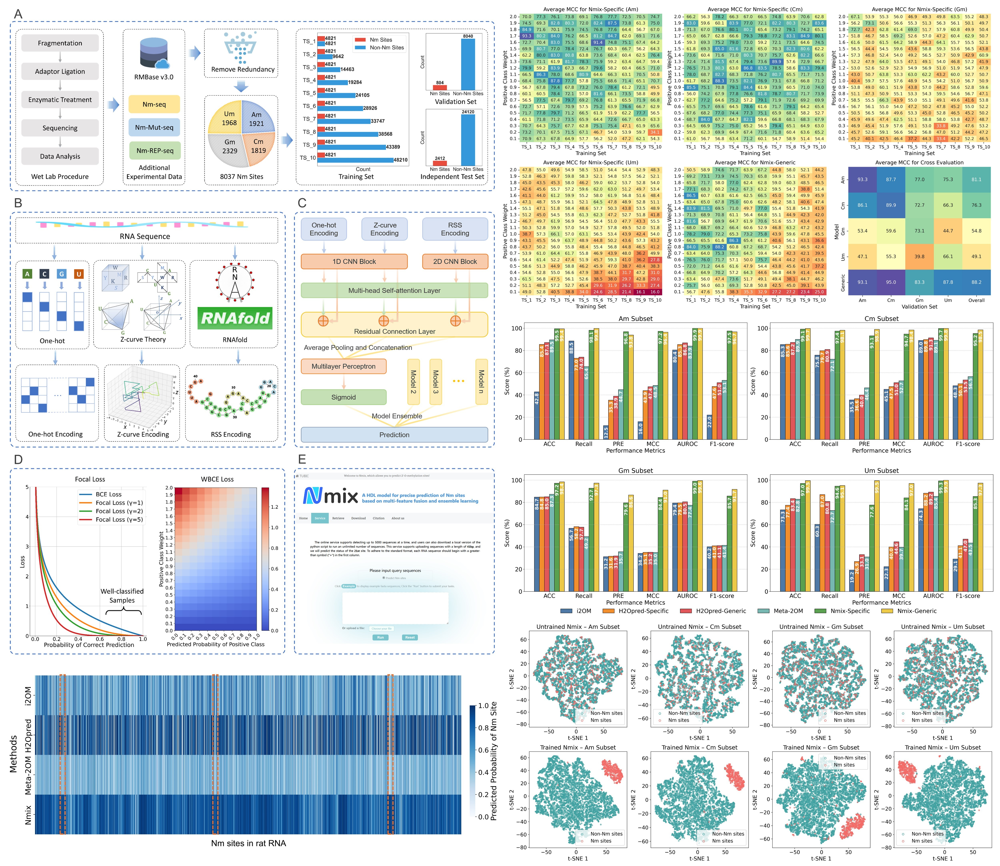

       

---

# Table of Contents

- [Introduction](#Introduction)
- [Local Prediction Guide](#Local-Prediction-Guide)
   1. [Installation](#installation)
   2. [Usage](#usage)
      - [Nmix-Specific](#nmix-specific)
      - [Nmix-Generic](#nmix-generic)
   3. [Input Format](#input-format)
   4. [Output Format](#output-format)
   5. [Example](#example)
- [Dataset Guide](#Dataset-Guide)
   1. [Directory Structure](#Directory-Structure)
   2. [File Format](#File-Format)
- [Testing Nmix](#Testing-Nmix)
- [Citation](#citation)
- [Contact](#contact)

# Introduction

RNA 2’-O-methylation (Nm) is a crucial post-transcriptional modification with significant biological implications. However, experimental identification of Nm sites is challenging and resource-intensive. While multiple computational tools have been developed to identify Nm sites, their predictive performance, particularly in terms of precision and generalization capability, remains deficient. 

We introduced Nmix, an advanced computational tool for precise prediction of Nm sites in human RNA. We constructed the largest, low-redundancy dataset of experimentally verified Nm sites and employed an innovative multi-feature fusion approach, combining one-hot, Z-curve and RNA secondary structure encoding. Nmix utilizes a meticulously designed hybrid deep learning architecture, integrating 1D/2D convolutional neural networks, self-attention mechanism and residual connection. We implemented asymmetric loss function and Bayesian optimization-based ensemble learning, substantially improving predictive performance on imbalanced datasets. Rigorous testing on two benchmark datasets revealed that Nmix significantly outperforms existing state-of-the-art methods across various metrics, particularly in precision, with average improvements of 33.1% and 60.0%, and Matthews correlation coefficient, with average improvements of 24.7% and 51.1%. Notably, Nmix demonstrated exceptional cross-species generalization capability, accurately predicting 93.8% of experimentally verified Nm sites in rat RNA. We also developed a user-friendly web server (https://tubic.org/Nm) and provided standalone prediction scripts to facilitate widespread adoption. 

We hope that by providing a more accurate and robust tool for Nm site prediction, we can contribute to advancing our understanding of Nm mechanisms and potentially benefit the prediction of other RNA modification sites.



---

# Nmix Local Prediction Guide

If you have a small number of sequences to predict, you can use our online prediction tool at https://tubic.org/Nm. This web-based interface provides a convenient way to get predictions without setting up the local environment.

## Installation

1. Clone the repository:

   ```bash
   git clone https://github.com/tubic/Nmix.git
   cd Nmix
   ```

2. Create a conda environment:

   ```bash
   conda create -n nmix python=3.9.18
   conda activate nmix
   conda install pytorch==1.12.1 torchvision==0.13.1 torchaudio==0.12.1 cpuonly -c pytorch
   pip install -r requirements.txt
   ```

> Note: Since Nmix doesn't require extensive GPU resources for inference, we provide a CPU-based PyTorch installation by default, which is compatible with most devices.

## Usage

Nmix provides two prediction models: Nmix-Specific and Nmix-Generic. Both models accept a FASTA file as input and generate a CSV file as output. Based on our test results, we recommend prioritizing the use of **Nmix-Generic**.

### Nmix-Specific

Nmix-Specific uses separate models for each nucleotide (A, C, G, U) at the center position.

```bash
python specific_predict.py -i [INPUT_FASTA] -o [OUTPUT_CSV]
```

### Nmix-Generic

Nmix-Generic uses a single model for all sequences regardless of the center nucleotide.

```bash
python generic_predict.py -i [INPUT_FASTA] -o [OUTPUT_CSV]
```

Parameters:

- `-i` or `--input`: Path to the input FASTA file.
- `-o` or `--output`: Path to the output CSV file.

## Input Format

The input should be a FASTA file containing RNA sequences. Each sequence must be exactly 41 nucleotides in length, with the target nucleotide for Nm site prediction located at position 21 (center position).

Example:

```fasta
>seq_1
UGGUCGCAAUGUCCUUGUGAAAGAUCUGAAGACUCACCCUG
>seq_2
GGUCGGCGUGGUCCCUGGUCCAGUCGGAGAGCCAGGUGGGU
>seq_3
AAUGGGGUCAGCCUUCCACUGGGCACAUUUCUGCCCACCUU
>seq_4
GAGCUUUUUGUAUUUAUGUAGCUAUUUAUCACAGACUAGCC
```

> Note: Any 'T' in the sequences will be automatically converted to 'U', and all letters will be converted to uppercase.

## Output Format

The output is a CSV file with the following columns:

- **ID**: Sequence identifier from the FASTA file
- **Sequence**: The input RNA sequence
- **Probability**: The predicted probability of the site being an Nm site (between 0 and 1)
- **Prediction**: 'Nm site' if the probability is > 0.5, otherwise 'non-Nm site'

## Example

A sample FASTA file (`sample.fasta`) is provided in the repository. You can use it to test the prediction:

```bash
python specific_predict.py  -i sample.fasta -o sample_specific_output.csv
python generic_predict.py  -i sample.fasta -o sample_generic_output.csv
```

# Dataset Guide

## Directory Structure

The `dataset` directory contains five subdirectories: `A`, `C`, `G`, `U`, and `all`. The `A`, `C`, `G`, and `U` directories contain subsets of Nm site data for different nucleobase types, while the `all` directory contains the merged data from all four subsets.

Each subdirectory (`A`, `C`, `G`, `U`, and `all`) contains 12 CSV files:

- Ten training sets (`TS_1.csv` to `TS_10.csv`) with identical positive samples but different numbers of negative samples. The ratio of negative to positive samples ranges from 1:1 to 10:1 across these files.
- One validation set (`val.csv`) with a 10:1 ratio of negative to positive samples
- One test set (`test.csv`) with a 10:1 ratio of negative to positive samples

The positive samples are distributed across training, validation, and test sets in a 6:1:3 ratio.

> Note: If you don't need a validation set (e.g., when using cross-validation), you may merge it into either the training or test set. 

> Note: You can choose to train your model using only common positive-to-negative sample ratios (such as `TS_1`, `TS_2`, and `TS_10`) or experiment with all provided training sets.

## File Format

Each CSV file contains 7 columns:

- **id**: Unique identifier for each site
- **chr**: Chromosome number where the site is located
- **pos**: Genomic position of the site
- **strand**: DNA strand direction, '+' for forward strand or '-' for reverse strand
- **seq**: 41-nucleotide RNA sequence centered at the modification site
- **label**: Binary label indicating the presence (1) or absence (0) of Nm modification
- **structure**: Secondary structure of the RNA sequence in dot-bracket notation, where dots represent unpaired nucleotides and brackets represent base-paired nucleotides

# Testing Nmix

To enhance the transparency of our research, we provide two scripts—`specific_test.py` and `generic_test.py`—which allow for easy evaluation of the performance of Nmix-Specific and Nmix-Generic on the test datasets.

- Testing Nmix-Specific

You can use the following commands to test Nmix-Specific for each subset:

```bash
python test.py -i ./dataset/A/test.csv -o ./specific_test_A.csv
python test.py -i ./dataset/C/test.csv -o ./specific_test_C.csv
python test.py -i ./dataset/G/test.csv -o ./specific_test_G.csv
python test.py -i ./dataset/U/test.csv -o ./specific_test_U.csv
```

- Testing Nmix-Generic

You can use the following commands to test Nmix-Generic for each subset:

```bash
python test.py -i ./dataset/A/test.csv -o ./generic_test_A.csv
python test.py -i ./dataset/C/test.csv -o ./generic_test_C.csv
python test.py -i ./dataset/G/test.csv -o ./generic_test_G.csv
python test.py -i ./dataset/U/test.csv -o ./generic_test_U.csv
```

These commands will test the performance of Nmix-Specific and Nmix-Generic, outputting the predictions and performance metrics for each nucleotide.

# Citation

If you use Nmix or our proposed datasets in your research, please consider citing our paper: 

> Geng, Y.-Q., Lai, F.-L., Luo, H., & Gao, F. (2024). Nmix: A hybrid deep learning model for precise prediction of 2’-O-methylation sites based on multi-feature fusion and ensemble learning. *Briefings in Bioinformatics*, 25(6), bbae601. https://doi.org/10.1093/bib/bbae601

# Contact

For inquiries or issues, please contact the corresponding authors:

Feng Gao (fgao@tju.edu.cn), 
Hao Luo (hluo@tju.edu.cn)

